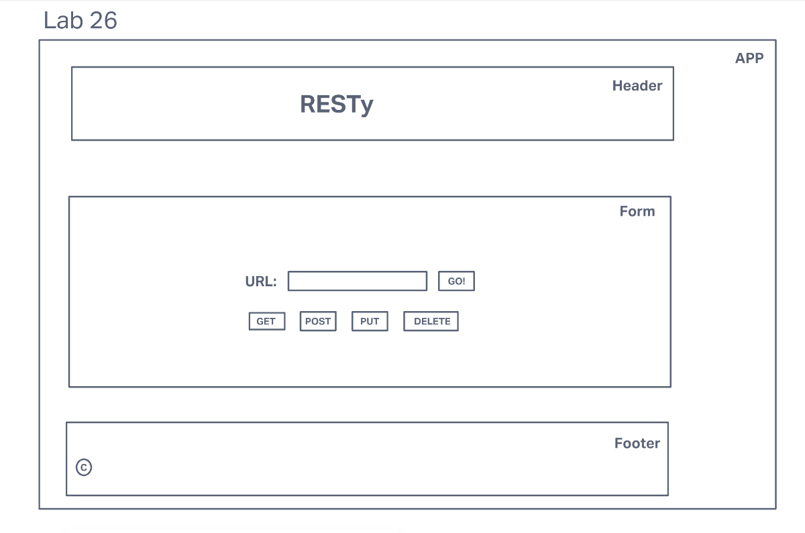

# LAB - Class 26

## Project: RESTy API

### Author: Yen Xiong Yuan

### Problem Domain

Today, we begin the first of a 4-Phase build of the RESTy application, written in React. In this first phase, our goal is to setup the basic scaffolding of the application, with intent being to add more functionality to the system as we go. This initial build sets up the file structure so that we can progressively build this application in a scalable manner.

#### Convert all child components of <App /> from classes to functions.

* The <App /> component serves as the container for all sub-components of this application.
* Leave this component as a Class.
* Make sure all base styles for <App /> are included in a .scss imported within the App.jsx file.
* Ensure that the <Header />, <Footer />, <Results /> and <Form /> components are imported using ES6 import syntax.  
      

#### Use .scss files to style each component.

* Each of the components use their own .scss file for styling.  
      

#### Core application functionality should remain unchanged.

* The <Form /> component should: 
* Call a function onSubmit() that updates the <App /> component via a function sent down as a prop so that the app can process the form values.  
* The <Results /> component should show mock API results.  

### Links and Resources

- [GitHub Actions ci/cd](https://github.com/yenxiongyuan/resty/actions/new)

### How to use

npx create-react-app npm start

#### How to initialize/run your application (where applicable)

- e.g. `npm start`

#### How to use your library (where applicable)

#### Features / Routes

- Feature One: Details of feature
- GET : `/hello` - specific route to hit

#### Tests

- How do you run tests?
- Any tests of note?
- Describe any tests that you did not complete, skipped, etc

#### UML

